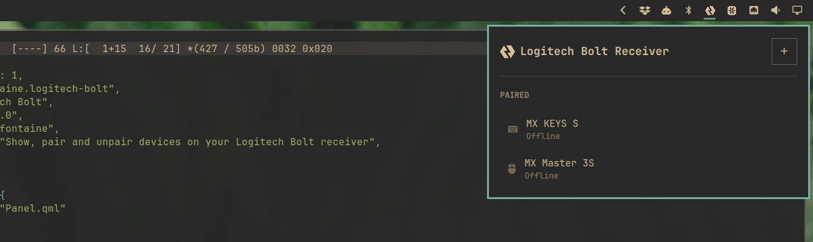

# Logitech Bolt

An [Omarchy](https://omarchy.org) shell plugin that shows the devices paired to your Logitech Bolt receiver right in the bar, and lets you pair or unpair them without needing Solaar or any other companion app.

Click the icon to see connected devices, their kind, and battery level. Discover and pair new devices, or unpair ones you no longer use — all from the panel.



## Install

```
omarchy plugin add https://github.com/axelfontaine/omarchy-logitech-bolt.git --enable
```

## Uninstall

```
omarchy plugin remove axelfontaine.logitech-bolt
```

## Permissions

Talking to the receiver requires read/write access to its `hidraw` device node, which isn't granted by default. If the panel shows a permission error, click the **Fix permissions** button inside it — it installs a udev rule (via a one-time authentication prompt) that grants your user access, no reboot required.

## Dependencies

No external dependencies. Everything needed to talk to the receiver is built in.

## License

MIT
